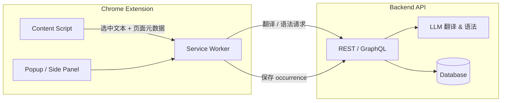

# KeepMark · 留标

> 读英文，选中即译；记录每一次阅读行为，**日积月累，逐渐像母语者一样读英文**。

Chrome 浏览器插件：用最简单的交互获取 **翻译** 与 **语法**，保存你的阅读行为；句内词库智能降噪，**★ 留标** 的词长期积累成个人轨迹。

> 产品说明详见 [spec/product.md](./spec/product.md)

---

## 为什么叫 KeepMark

| 你想解决的问题 | KeepMark 怎么对应 |
|----------------|-------------------|
| 读英文查词太打断 | 选中即出释义，无需再点 |
| 只想学真正关心的词 | ★ 标记 = 进入你的词库 |
| 常见词、见过但没学的词太吵 | 未标记且再次出现 → 自动略过 |
| 忘了词在什么句子里见过 | 按句拆分 + 出现次数 + 语境落库 |

---

## 背景与目标

读英文文章时常见痛点：

- 查词要切换 Tab，打断阅读节奏
- 只看释义，不清楚句子结构和语法点
- 查过的词容易忘，缺少「在什么文章、什么语境下见过」的记录

本插件希望在 **当前页面内** 完成查词与学习，并把每一次交互结构化写入数据库，形成个人词库与阅读足迹。

---

## 核心功能

### 1. 快捷翻译（Quick Translate）

在任意英文网页上 **选中文字**（单词、短语或句子），通过快捷键或右键菜单唤起翻译面板。

| 能力 | 说明 |
|------|------|
| 即时释义 | 中文释义 + 词性 + 常见搭配 |
| 上下文感知 | 自动携带选中词前后若干字符作为语境 |
| 多粒度 | 支持单词 / 短语 / 整句 |
| 离线降级 | AI 不可用时，可降级到词典 API（可选） |

**典型流程**

```
选中 "notwithstanding" → 自动弹出释义（无需再点）
→ 可选 Header [★] 保存 / [语法]
```

---

### 2. 语法解释（Grammar Explain）

对选中 **句子或从句** 做结构化语法讲解，而不只是字面翻译。

| 输出项 | 示例 |
|--------|------|
| 句子成分 | 主语 / 谓语 / 宾语 / 状语 |
| 从句类型 | 定语从句、状语从句、同位语等 |
| 时态语态 | 现在完成被动、虚拟语气等 |
| 难点提示 | 为什么这里用 `were` 而不是 `was` |
| 简化复述 | 用更简单的英文或中文概括句意 |

**典型流程**

```
选中整句 → 点击「语法讲解」
→ AI 返回分段解析 + 重点标注
→ 可选保存为「语法笔记」，关联当前页面 URL
```

---

### 3. 单词落库与出现记录（Word Occurrence Tracking）

每次翻译或主动保存时，将单词及 **出现场景** 写入后端数据库，用于复习、统计和语境回顾。

#### 记录什么

| 字段 | 说明 |
|------|------|
| `word` | lemma / 原形（如 `running` → `run`） |
| `original_text` | 页面上的原始选中文本 |
| `translation` | 释义或句子翻译 |
| `grammar_note` | 语法讲解摘要（若有） |
| `context_before` | 选区前 N 个字符 |
| `context_after` | 选区后 N 个字符 |
| `sentence` | 选区所在完整句子（自动抽取） |
| `page_url` | 来源页面 |
| `page_title` | 文章标题 |
| `domain` | 站点域名，便于按来源筛选 |
| `occurred_at` | 首次/本次出现时间 |
| `review_count` | 复习次数 |
| `mastery_level` | 熟悉度（生词 / 模糊 / 掌握） |

#### 业务规则（草案）

1. **同一单词 + 同一 URL + 同一句子**：合并为一条 occurrence，增加 `seen_count`
2. **同一单词、不同 URL 或不同句子**：新增 occurrence，保留多条语境
3. 支持手动标记「已掌握」，后续同词可降频提示
4. 词库页可按：时间 / 域名 / 熟悉度 / 出现次数 筛选

#### 数据价值

- 复习时看到 **真实阅读语境**，而不是孤立背单词
- 统计「哪些站点的词汇更难」「最近 7 天新增多少生词」
- 为后续 Anki 导出、间隔重复打基础

---

## 用户界面（规划）

```
┌─────────────────────────────────────────────────────────┐
│  [英文文章网页]                                          │
│                                                         │
│   ... The decision, notwithstanding the risks, ...      │
│              ▲ 选中词                                    │
│              └── 浮动工具条 [翻译] [语法] [保存]          │
└─────────────────────────────────────────────────────────┘
         │
         ▼
┌──────────────────┐     ┌──────────────────────────────┐
│  Popup / Side    │     │  插件 Options / 词库页          │
│  翻译 + 语法结果  │     │  单词列表 · 语境 · 复习队列     │
└──────────────────┘     └──────────────────────────────┘
```

| 入口 | 作用 |
|------|------|
| Content Script 浮层 | 选词后的即时操作 |
| Popup | 快捷设置、今日统计、打开词库 |
| Side Panel（Chrome 114+） | 常驻翻译/语法面板，适合长文阅读 |
| Options 页 | API Key、快捷键、同步与导出 |

---

## 系统架构



### 插件内模块

| 模块 | 职责 |
|------|------|
| `content` | 监听选中、注入浮层、抽取句子与上下文 |
| `background` | 请求聚合、鉴权、缓存、与后端通信 |
| `popup` / `sidepanel` | 设置、词库快捷入口 |
| `options` | 账号、API、同步策略 |
| `shared` | 类型定义、常量、工具函数 |

### 后端（待实现）

| 服务 | 职责 |
|------|------|
| `POST /translate` | 翻译（带 context） |
| `POST /grammar` | 语法讲解 |
| `POST /words` | 创建/更新单词 occurrence |
| `GET /words` | 词库列表、筛选、分页 |
| `PATCH /words/:id` | 更新熟悉度、复习次数 |
| `GET /stats` | 学习统计 |

---

## 数据库设计（草案）

### 表：`users`

用户标识（插件登录或 device id + 可选账号绑定）。

### 表：`words`

| 列 | 类型 | 说明 |
|----|------|------|
| id | UUID | 主键 |
| user_id | UUID | 所属用户 |
| lemma | VARCHAR | 单词原形 |
| translation | TEXT | 默认释义 |
| mastery_level | SMALLINT | 0 生词 / 1 模糊 / 2 掌握 |
| first_seen_at | TIMESTAMP | 首次收录 |
| last_seen_at | TIMESTAMP | 最近出现 |
| total_occurrences | INT | 总出现次数 |

唯一约束：`(user_id, lemma)`

### 表：`word_occurrences`

| 列 | 类型 | 说明 |
|----|------|------|
| id | UUID | 主键 |
| word_id | UUID | 关联 words |
| original_text | TEXT | 原文选区 |
| sentence | TEXT | 所在句子 |
| context_before | TEXT | 前文 |
| context_after | TEXT | 后文 |
| page_url | TEXT | 页面 URL |
| page_title | TEXT | 标题 |
| domain | VARCHAR | 域名 |
| grammar_note | TEXT | 语法笔记（可空） |
| seen_count | INT | 同语境重复次数 |
| occurred_at | TIMESTAMP | 记录时间 |

索引：`(word_id, occurred_at)`、`(user_id, domain)`

### 表：`grammar_notes`（可选）

独立保存整句语法讲解，与 occurrence 多对一关联。

---

## 技术栈

| 层级 | 选型 |
|------|------|
| 插件 | Chrome Extension **Manifest V3** |
| 语言 | TypeScript |
| 构建 | Vite + `@crxjs/vite-plugin` 或 WXT |
| UI | React（Popup / Side Panel / Options） |
| 后端 | Go + Kratos |
| 数据库 | PostgreSQL 或 SQLite（本地原型） |
| AI | OpenAI / Claude API（翻译 + 语法） |

---

## 项目结构

```
keepmark/
├── README.md                 # 本文件
├── product.md                # 产品说明
├── spec/                     # 规格文档
├── extension/                # Chrome 插件
│   ├── manifest.json
│   ├── package.json
│   ├── src/                  # background / content / popup / options / shared
│   ├── public/
│   └── docs/                 # ui-spec.md、ui-preview.html
└── server/                   # Kratos 后端 API
    ├── cmd/server/
    ├── internal/
    ├── api/
    └── configs/
```

---

## 权限说明（Manifest V3）

| 权限 | 用途 |
|------|------|
| `activeTab` | 读取当前页选中内容与 URL |
| `storage` | 本地缓存设置与离线队列 |
| `contextMenus` | 右键「翻译 / 语法讲解」 |
| `sidePanel` | 侧边栏阅读模式（可选） |
| `host_permissions` | 调用后端 API |

> 原则：最小权限；敏感数据（API Key）仅存 `chrome.storage.local` 或后端会话，不写进 content script。

---

## 开发路线

### Phase 1 — 阅读体验（MVP）

- [ ] Content Script：选词 + 浮动工具条
- [ ] 翻译面板（调用后端或直连 LLM）
- [ ] 基础 Popup：设置 API 地址

### Phase 2 — 语法与学习

- [ ] 语法讲解面板
- [ ] 句子与上下文自动抽取
- [ ] 手动「保存到词库」

### Phase 3 — 落库与词库

- [ ] 后端 API + 数据库
- [ ] 自动/手动写入 `words` + `word_occurrences`
- [ ] Options 词库列表页（Web 或插件内）

### Phase 4 — 复习与增强

- [ ] 熟悉度标记、复习提醒
- [ ] 按域名 / 时间统计
- [ ] 导出 Anki / CSV
- [ ] 生词本降频与高亮已掌握词

---

## 本地开发（占位）

```bash
# 插件
cd extension
npm install
npm run dev

# 后端
cd server
make build && make run
```

Chrome 加载方式：

1. 打开 `chrome://extensions`
2. 开启「开发者模式」
3. 「加载已解压的扩展程序」→ 选择 `dist/` 目录

环境变量见 `.env.example`。

---

## 隐私与安全

- 仅在上传时发送 **用户选中的文本** 及 **页面 URL/标题**，不上传整页 HTML
- API Key 由用户自行配置或使用后端代签 Token
- 支持「仅本地缓存、不同步云端」模式（后续）
- 数据库按 `user_id` 隔离，不跨用户共享词库

---

## 相关链接

- 父仓库：[AI Toys](../README.md)
- **UI 定稿**：[extension/docs/ui-spec.md](./extension/docs/ui-spec.md)
- **UI 可视化预览**：用浏览器打开 [extension/docs/ui-preview.html](./extension/docs/ui-preview.html)
- Chrome Extension MV3 文档：https://developer.chrome.com/docs/extensions/mv3/

---

## 许可证

MIT（与 AI Toys 仓库保持一致，若父仓库另有约定则以父仓库为准）。
