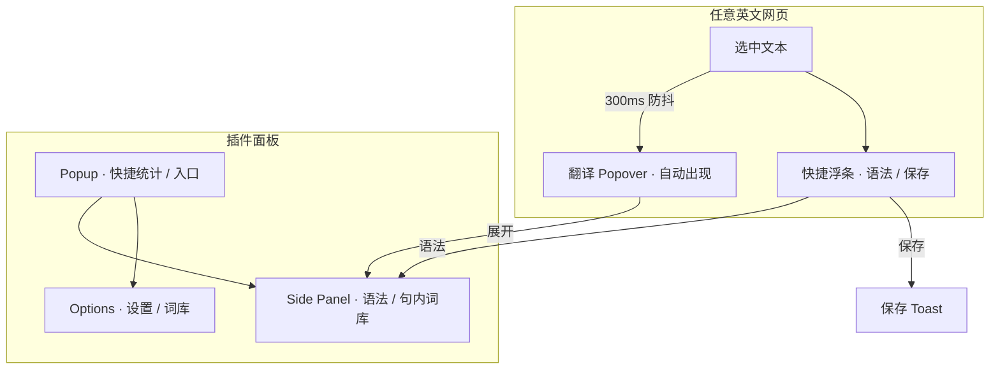

# UI 定稿 — KeepMark · 留标

> 版本：v1.0 · 状态：**定稿待确认**  
> 适用范围：Chrome Extension MV3 · Content Script / Side Panel / Popup / Options

**设计稿预览（与实现对齐）：** 打开 [../../design/design.html](../../design/design.html) — 引用 `extension/assets/styles/ui.css`，DOM 结构同 `entrypoints/`。

---

## 1. 设计原则

| 原则 | 说明 |
|------|------|
| **不打断阅读** | 默认浮层小、贴选区；长内容进 Side Panel |
| **一屏一事** | 浮条负责操作；Popover 负责快译；Side Panel 负责语法与落库详情 |
| **与宿主隔离** | 全部 UI 走 Shadow DOM + 内置 CSS，不继承页面样式 |
| **轻量默认可读** | 默认浅色主题；高对比文字；无大面积动效 |
| **状态可感知** | 加载 / 成功 / 失败 / 已保存，均有明确反馈 |

---

## 2. 信息架构



### 入口分工（定稿）

| 入口 | 用途 | 不做 |
|------|------|------|
| **翻译 Popover** | **选中即展示**释义（默认，无需再点） | 不做语法长解析 |
| **选词浮条** | 语法 / 保存 / 关闭（附在 Popover 上方） | 不承担「触发翻译」 |
| **Side Panel** | 语法讲解、语境、落库确认、词库浏览 | 不替代 Popup 设置 |
| **Popup** | 今日统计、打开 Side Panel、开关 | 不做阅读主流程 |
| **Options 页** | API、快捷键、导出 | 不做阅读中交互 |

---

## 3. Design Tokens

### 3.1 颜色（浅色主题 · 默认唯一主题）

| Token | 值 | 用途 |
|-------|-----|------|
| `--era-bg` | `#FFFFFF` | 面板背景 |
| `--era-bg-muted` | `#F6F7F9` | 区块背景、语境引用 |
| `--era-bg-hover` | `#EEF1F5` | 按钮 hover |
| `--era-border` | `#E2E6ED` | 边框、分割线 |
| `--era-text` | `#1A1D23` | 主文字 |
| `--era-text-secondary` | `#5C6570` | 次要说明 |
| `--era-text-tertiary` | `#8B939E` | 占位、时间戳 |
| `--era-primary` | `#2563EB` | 主按钮、链接 |
| `--era-primary-hover` | `#1D4ED8` | 主按钮 hover |
| `--era-primary-soft` | `#EFF6FF` | 选中高亮底 |
| `--era-success` | `#059669` | 已保存、掌握 |
| `--era-warning` | `#D97706` | 模糊词、提醒 |
| `--era-error` | `#DC2626` | 错误 |
| `--era-highlight` | `#FEF08A` | 原文中生词高亮（页面注入标记） |

**Shadow：** `0 4px 24px rgba(15, 23, 42, 0.12), 0 0 1px rgba(15, 23, 42, 0.08)`

### 3.2 字体

| Token | 值 |
|-------|-----|
| `--era-font` | `system-ui, -apple-system, "Segoe UI", Roboto, "PingFang SC", "Microsoft YaHei", sans-serif` |
| `--era-font-mono` | `"SF Mono", "Menlo", "Consolas", monospace` |
| `--era-text-xs` | `11px / 16px` |
| `--era-text-sm` | `12px / 18px` |
| `--era-text-base` | `14px / 22px` |
| `--era-text-lg` | `16px / 24px` |
| `--era-text-xl` | `18px / 28px` |

### 3.3 间距与圆角

| Token | 值 |
|-------|-----|
| `--era-space-1` | `4px` |
| `--era-space-2` | `8px` |
| `--era-space-3` | `12px` |
| `--era-space-4` | `16px` |
| `--era-space-5` | `20px` |
| `--era-space-6` | `24px` |
| `--era-radius-sm` | `6px` |
| `--era-radius-md` | `10px` |
| `--era-radius-lg` | `14px` |
| `--era-radius-full` | `9999px` |

### 3.4 层级

| 元素 | z-index |
|------|---------|
| 页面生词高亮 | `2147483640` |
| 选词浮条 | `2147483644` |
| 翻译 Popover | `2147483645` |
| Toast | `2147483646` |
| Side Panel | Chrome 原生（不占页面 z-index） |

### 3.5 动效

| 场景 | 规则 |
|------|------|
| 浮条 / Popover 出现 | `opacity + translateY(4px→0)`，**120ms** `ease-out` |
| 浮条 / Popover 消失 | **80ms** `ease-in` |
| Toast | 淡入 120ms，停留 **2s**，淡出 200ms |
| 加载 Spinner | 旋转 800ms linear 循环 |
| **禁止** | 弹跳、大面积 blur、超过 200ms 的过渡 |

---

## 4. 组件定稿

### 4.1 翻译 Popover · TranslatePopover（主入口 · 选中即译）

**触发（默认）：** 用户选中 ≥ 1 个字符，松开鼠标后 **300ms** 内无新选中 → **自动请求并展示翻译**（无需再点「翻译」）。

**关闭后重选：** 同一选区微调不重复请求；选区文本变化则重新翻译。

**位置：** 选区 bounding box **正下方 8px**；若距视口底部不足以容纳 Popover，改到 **正上方**。水平居中对齐选区，clamp 在视口左右各 12px 内。

**尺寸：** 宽 **300px**，max-height **160px**（仅 Header + 释义，无 Footer）。

**结构线框（极简）：**

```
┌─ notwithstanding ──────────── [语法] [☆] [×] ────────┐
│  adv.  尽管；虽然                                      │
└──────────────────────────────────────────────────────┘
（保存后星标变为 ★ 实心高亮）
```

| 区块 | 规格 |
|------|------|
| Header 一行 | 左：原词；右：`语法`(32px 高) · `☆/★` 保存 · `×` 关闭 |
| 保存星标 | 未保存 **☆** 空心；已保存 **★** 实心 + 琥珀色高亮 |
| 释义区 | **仅 1～2 行**：词性 tag + 中文释义 |
| Footer | **v1 无**（不设保存 / 复制 / 更多第二行） |
| 加载态 | 释义区 2 行 skeleton，**≤500ms** 内应出结果 |

**错误态：** 红色一行 + 「重试」，Popover 不自动关闭。

**Options 开关：**「选中即翻译」Toggle，**默认开启**。关闭后仅保留选词浮条，需手动触发（Phase 2 可接快捷键）。

---

### 4.2 快捷浮条 · SelectionBar（可选 · 与 Popover 同现）

Popover Header 已含 `[语法][★][×]` 时，**可省略独立浮条**。若实现上仍拆两层：

**触发：** 与 Popover 同时出现（同一防抖回调）。

**结构（无「翻译」）：**

```
┌────────────────────────────────────────────┐
│  notwithstanding   [语法]  [★ 保存]  [×]  │
└────────────────────────────────────────────┘
```

| 区域 | 规格 |
|------|------|
| 选词预览 | max-width **120px**，超出 `…` |
| 按钮 | 仅 **语法 / 保存 / 关闭**，均为 outline 或 ghost，**不设主色「翻译」** |

**快捷键：**

| 按键 | 动作 |
|------|------|
| `Alt + G` | 语法（打开 Side Panel） |
| `Alt + S` | 保存 |
| `Alt + R` | 重新翻译（仅「选中即翻译」关闭时；默认开时可省略） |
| `Esc` | 关闭 Popover + 浮条 |

---

### 4.3 Side Panel · 语法 / 详情 / 词库

**宽度：** Chrome Side Panel 默认（约 **360px**，内容区 min-width **320px**）。

**Tab 结构（定稿 2 Tab）：**

```
┌─────────────────────────────────────┐
│  KeepMark · 留标          │
├──────────────────┬──────────────────┤
│  语法            │  词库            │
├──────────────────┴──────────────────┤
│  （Tab 内容区，可滚动）               │
└─────────────────────────────────────┘
```

#### Tab A · 语法 Grammar

**触发：** 浮条「语法」/ Popover「展开」/ `Alt+G`。

```
┌─ 原句 ─────────────────────────────────────────────┐
│ The decision, notwithstanding the risks, was final. │
└────────────────────────────────────────────────────┘

┌─ 句意 ─────────────────────────────────────────────┐
│ 尽管存在风险，该决定仍是最终决定。                    │
└────────────────────────────────────────────────────┘

┌─ 结构分析 ─────────────────────────────────────────┐
│ • 主句：The decision was final                        │
│ • 插入语：notwithstanding the risks（介词短语作状语） │
│ • 时态：一般过去时                                   │
└────────────────────────────────────────────────────┘

┌─ 难点 ─────────────────────────────────────────────┐
│ notwithstanding 较正式，常置于句中或句首…            │
└────────────────────────────────────────────────────┘

[★ 保存语法笔记]     熟悉度：○ 生词  ○ 模糊  ● 掌握
```

| 区块 | 规格 |
|------|------|
| 原句卡片 | `--era-bg-muted`，padding `12px`，选区词 `--era-primary-soft` 底色 |
| 小节标题 | `--era-text-sm`，font-weight **600**，`--era-text-secondary`，margin-top `16px` |
| 列表项 | `--era-text-base`，行高 22px，圆点 `--era-primary` |
| 熟悉度 | 3 个 radio pill，高 **32px**，选中 `--era-primary-soft` + 边框 `--era-primary` |
| 底部操作 |  sticky bottom bar，高 **56px**，顶部分割线，主按钮全宽 |

#### Tab B · 词库（当前句拆分）

**触发：** 选中任意词/句后自动填充；可手动切到「词库」Tab 查看。

**内容：** 展示选区所在整句拆分后的单词列表（按首次出现顺序去重），**不展示整句原文**。

```
句内词汇 · 8 个
────────────────────────────────────────
decision        n.   决定；决策       2 次   [☆]
notwithstanding adv. 尽管；虽然       1 次   [☆]
the             art. 这；那          3 次   [★]
…
```

| 列 | 规格 |
|----|------|
| 标题 | `句内词汇 · N 个`（去重后的词数） |
| 词行 | 原文 · 词性 · 释义 · **出现次数** · `☆/★` |
| 出现次数 | 阅读过程中累计出现次数 |
| 展示规则 | **首次出现且未标记** → 展示；**曾出现但未点 ★ 标记** → 后续不再展示；**已标记** → 始终展示 |
| 当前选中词 | 词行 `active` 高亮 |
| 保存 | 每行 `☆/★`，与 Popover Header 联动 |

**不做：** 词库 Tab 内展示整句卡片；不做「本次」Tab。

---

### 4.4 保存 Toast

**触发：** 点击「保存」且 API 成功。

**样式：** 固定视口 **底部 24px 居中**，高 **40px**，padding `0 16px`，圆角 `--era-radius-full`，背景 `#1A1D23`，文字白色 `--era-text-sm`。

**文案：**

| 场景 | 文案 |
|------|------|
| 新词 | `已保存「notwithstanding」到词库` |
| 已有词 + 新语境 | `已记录「run」的新语境` |
| 重复同语境 | `已在本篇记录过该词`（warning 色 icon） |

---

### 4.5 Popup（工具栏图标）

**尺寸：** 宽 **300px**，padding `16px`，无 min-height。

```
┌─ KeepMark · 留标 ─────────┐
│                                     │
│  今日新增生词          12           │
│  待复习                5            │
│                                     │
│  [打开阅读面板]    [词库与设置]      │
│                                     │
│  ☑ 在阅读页启用浮条                 │
└─────────────────────────────────────┘
```

| 元素 | 规格 |
|------|------|
| 统计数字 | `--era-text-xl`，font-weight **700** |
| 统计标签 | `--era-text-sm`，`--era-text-secondary` |
| 主按钮 | 全宽，高 **36px** |
| 次按钮 | 全宽 outline，高 **36px**，margin-top `8px` |
| 开关 | Chrome 风格 toggle，标签 `--era-text-sm` |

---

### 4.6 Options 页

**布局：** 左侧导航 **200px** + 右侧内容区 max-width **720px**，整页 padding `32px`。

**导航项：**

1. 常规  
2. 快捷键  
3. API 与账号  
4. 词库管理  
5. 关于  

**「常规」定稿字段：**

| 字段 | 控件 |
|------|------|
| 选中即翻译 | Toggle，**默认开**（关则不再自动 Popover） |
| 启用选词浮条 | Toggle，默认开 |
| 语境截取长度 | Slider 60–200 字，默认 120（仅 Side Panel「更多」展示） |
| 保存后自动标记 | Select：不标记 / 生词 / 模糊 |
| 翻译语言 | Select：简体中文（v1 仅中文） |

**「API 与账号」：**

| 字段 | 控件 |
|------|------|
| API 地址 | Input URL |
| 连接测试 | Button → inline 成功/失败 |

---

## 5. 页面内高亮（可选 · Phase 2）

已落库且 familiar = 生词 / 模糊 的词，在 **同一域名** 再次访问时可淡高亮：

| 属性 | 值 |
|------|-----|
| 背景 | `rgba(254, 240, 138, 0.45)` |
| 下划线 | 无 |
| hover | 显示 mini tooltip「已收录 · 点击查看」 |

**不在 v1 默认开启**，Options 里 Toggle 默认关。

---

## 6. 状态规范

### 6.1 按钮状态

| 状态 | 样式 |
|------|------|
| default | 见各组件 |
| hover | 背景加深 / 描边 `--era-text-tertiary` |
| active | scale(0.98)，80ms |
| disabled | opacity **0.5**，cursor not-allowed |
| loading | 文案换 Spinner +「处理中…」，disabled |

### 6.2 空状态

| 场景 |  illustration | 文案 |
|------|---------------|------|
| Side Panel 语法 Tab 无选中 | 简单 SVG 书本 | 「在文章中选中句子后点击语法」 |
| 词库为空 | SVG  inbox | 「保存的第一个词会出现在这里」 |

插图尺寸 **64×64**，色 `#CBD5E1`，不依赖外部资源。

### 6.3 错误文案（用户可见）

| 错误 | 文案 |
|------|------|
| 网络 | 「网络异常，请检查后重试」 |
| API | 「服务暂时不可用（{code}）」 |
| 未登录 | 「请先在设置中配置 API 或登录」 |
| 选区过长 | 「选区过长，请缩短至 500 字以内」 |

---

## 7. 交互流程（定稿）

### 7.1 快译流程（默认 · 零额外点击）

```
选中词 → 300ms 防抖 → Popover 自动出现 + skeleton
                    → 展示释义（1～2 行）
                    → 可选 Header [★ 保存] / [语法 → Side Panel]
```

**原则：** 翻译是 **默认动作**，不是二级按钮；语法与落库是 **可选加深**。

### 7.2 语法流程

```
选中整句 → 浮条 → [语法] → Side Panel 打开并切到「语法」Tab → 流式输出（可选）
                                                              ↓
                                                    [保存语法笔记] + 熟悉度
```

### 7.3 保存流程

```
任意面板 [保存] → 按钮 loading → 成功 Toast 2s → 按钮短暂变「已保存 ✓」2s 后恢复
                              → 失败 inline 错误 + 重试
```

---

## 8. 技术实现约定

| 项 | 约定 |
|----|------|
| 样式隔离 | 每个 UI 根节点 `#era-root` + `attachShadow({ mode: 'open' })` |
| CSS | 组件内 `<style>` 或 Constructable Stylesheets，只用 CSS 变量 |
| 图标 | 16/20/24px SVG inline，stroke `currentColor`，stroke-width 1.5 |
| 选区检测 | `mouseup` + `selectionchange` 防抖；忽略 `input/textarea/contenteditable` 内选区（v1） |
| i18n | v1 仅简体中文 UI；文案集中 `src/shared/i18n/zh-CN.ts` |
| 响应式 | Popover/浮条仅适配桌面；最小视口宽度 **360px** |

---

## 9. 线框总览

```
┌────────────────────────── 浏览器视口 ──────────────────────────────┐
│  Article text with selected word highlighted                        │
│       ┌─ notwithstanding ─── [语法][★][×] ─┐                      │
│       │  adv. 尽管；虽然                      │  ← Popover 选中即现  │
│       └─────────────────────────────────────┘                       │
│                                                                     │
│                    ┌ Toast: 已保存到词库 ┐                          │
└────────────────────┴─────────────────────┴──────────────────────────┘

Side Panel (360px)          Popup (300px)
┌──────────────────┐        ┌─────────────────┐
│ [语法][词库]     │        │ 今日新增 12      │
│  …语法内容…       │        │ [打开阅读面板]   │
└──────────────────┘        └─────────────────┘
```

---

## 10. v1 范围与不做

### v1 包含

- TranslatePopover + Side Panel（语法 / 句内词库）
- Popup 统计 + 开关
- Options：常规 + API + 快捷键
- 浅色主题唯一
- Toast 反馈

### v1 不做

- 暗色主题
- 页面生词高亮（Phase 2）
- Popup 内嵌翻译
- 移动端 / 窄屏专用布局
- 自定义主题色

---

## 11. 确认清单

开发前请确认以下项（可逐条回复）：

- [ ] **选中即翻译**：选中后自动 Popover、无「翻译」按钮，是否 OK？
- [ ] **Popover 极简**：v1 仅 1～2 行释义，搭配/语境进 Side Panel「更多」，是否 OK？
- [ ] **配色**：蓝色主色 `#2563EB` + 浅灰背景是否 OK？
- [ ] **Popover 宽度** 320px / **Side Panel** 约 360px 是否 OK？
- [ ] **快捷键** `Alt+T/G/S` 是否与你的习惯冲突？
- [ ] **v1 仅浅色、仅中文 UI** 是否 OK？
- [ ] **保存成功 Toast 2 秒** 是否 OK？

---

## 12. 附录：组件命名（开发用）

| 组件名 | 文件建议 |
|--------|----------|
| `SelectionBar` | `src/content/components/SelectionBar.ts` |
| `TranslatePopover` | `src/content/components/TranslatePopover.ts` |
| `SaveToast` | `src/content/components/SaveToast.ts` |
| `SidePanelApp` | `src/sidepanel/App.tsx` |
| `PopupApp` | `src/popup/App.tsx` |
| `OptionsApp` | `src/options/App.tsx` |
| `tokens.css` | `src/shared/styles/tokens.css` |

---

*定稿确认后，按本文档实现；视觉微调允许在 ±2px / 色值 ±5% 内变动，不改变信息架构。*
