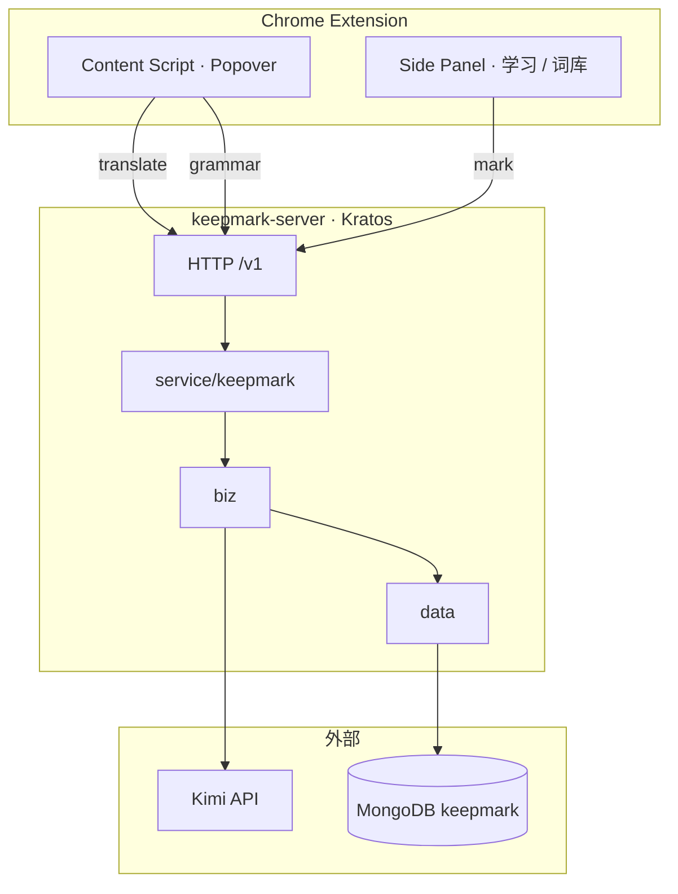

# KeepMark Server · 核心架构

> 版本：**v0.3 · 单用户 · 两表**  
> AI：**Kimi**（translate + learning + grammar）· 存储：**MongoDB**（`words` + `sentences`）

**业务 / UseCase（实现必读）** → [usecase.md](./usecase.md)

| 章 | 能力 | API |
|----|------|-----|
| 1 | Popover 快译 | `POST /v1/translate` |
| 2 | Side Panel 学习 | `POST /v1/grammar` |
| 3 | 留标 | `PUT /v1/words/mark` |

---

## 1. 系统上下文



### 职责

| 层 | 职责 |
|----|------|
| Extension | 选区、Popover 翻译、学习面板、词库选词留标 |
| Server | Kimi 调用 + `words` / `sentences` 读写 |
| Kimi | translate（8k）+ learning（32k） |
| MongoDB | 两表，无用户 |

**v0.3 不做：** 鉴权、多用户、句内自动分词 track、Redis。

---

## 2. 数据模型（两表）

详见 [data-model.md](./data-model.md)。

| 表 | `_id` | 作用 |
|----|-------|------|
| **`sentences`** | 全小写 sentence_id | Kimi 平铺：`translation`, `vocabulary`, `grammar`, `why_written`, `similar_sentences` |
| **`words`** | 小写 lemma | `seen_count` + `mark_count` + `sentence[]` |

```text
sentences._id  ←──  words.sentence[]
```

---

## 3. 代码目录

```text
server/
├── cmd/server/                 # 启动 + wire
├── configs/config.yaml
├── internal/
│   ├── pkg/
│   │   ├── kimi/               # Chat + TranslateSelection + ExplainLearning
│   │   └── translate/          # Translator 接口 → KimiTranslator
│   ├── biz/
│   │   └── keepmark.go         # KeepMarkUsecase（§ usecase.md）
│   ├── data/
│   │   ├── word_repo.go
│   │   └── sentence_repo.go
│   └── service/
│       └── keepmark.go         # HTTP handler（待注册路由）
└── spec/
    ├── architecture.md         # 本文件
    ├── usecase.md              # KeepMarkUsecase 三能力
    ├── api.md
    └── data-model.md
```

---

## 4. 三章流程摘要

详细流程与函数名见 **[usecase.md](./usecase.md)**。

```text
§1 translate
  POST /v1/translate → Kimi → upsert words（seen_count++）

§2 grammar / learning
  POST /v1/grammar → cache sentences 平铺字段 → 返回 vocabulary[] 供词库

§3 mark
  PUT /v1/words/mark → RecordMark → mark_count++ , recent_mark_time
```

---

## 5. 配置

```yaml
server:
  http:
    addr: 0.0.0.0:8080
    timeout: 30s

data:
  mongodb:
    uri: mongodb://127.0.0.1:27017
    database: keepmark

ai:
  kimi:
    base_url: https://api.moonshot.cn/v1
    api_key: ""
    grammar_model: moonshot-v1-32k
    translate_model: moonshot-v1-8k
    timeout: 25s
```

---

## 6. 实现顺序

1. `data`: `word_repo` + `sentence_repo`（按 details §4）
2. `biz` + `service`: §2 grammar（learning 缓存）
3. §1 translate
4. §3 RecordMark
5. 注册 HTTP 路由；Extension 去 mock

---

## 7. 相关文档

| 文档 | 内容 |
|------|------|
| [usecase.md](./usecase.md) | **KeepMarkUsecase** 核心依赖与逻辑 |
| [api.md](./api.md) | HTTP 契约 |
| [data-model.md](./data-model.md) | 数据模型：单词表 + 语法句子表 |
| [kimi-integration.md](./kimi-integration.md) | Prompt 与模型 |
