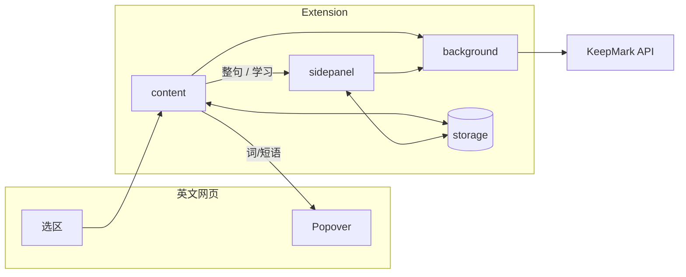
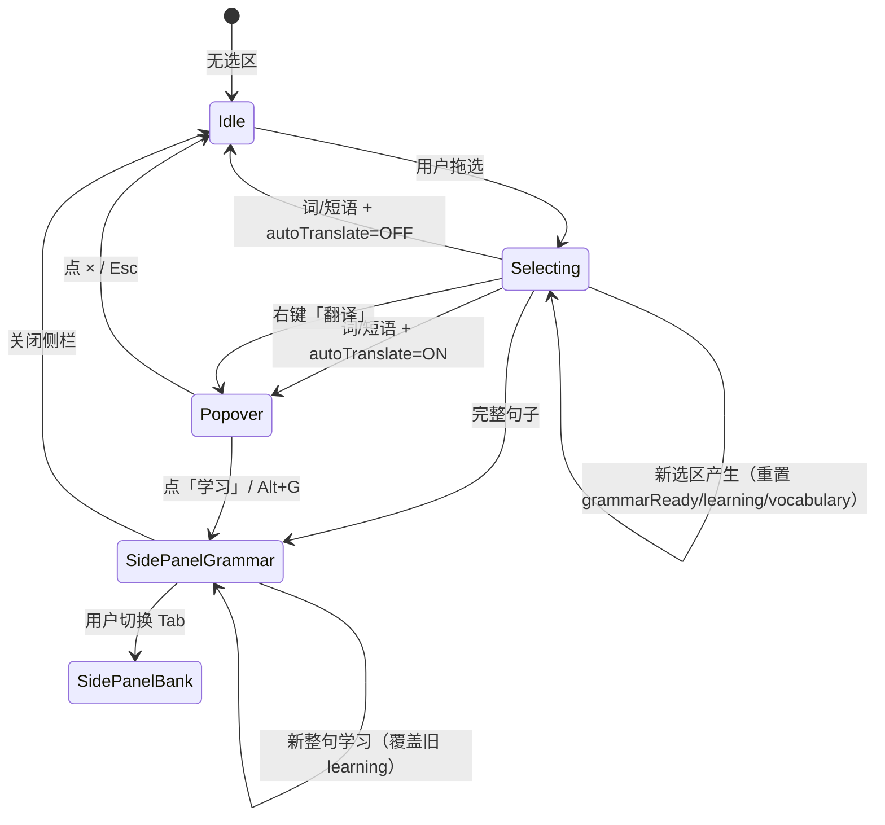

# KeepMark — 前端架构

> 最后更新：2026-07-19  
> 范围：`ai-toys/keepmark/`（Chrome 插件 + 设计稿）  
> **界面规格按面展开**：[ui/](./ui/README.md) · 产品：[product.md](./product.md) · **API 契约**：[peter-sever/spec/svc_keepmark/api.md](../../../peter-sever/spec/svc_keepmark/api.md)

本文只写 **总纲**：项目结构、运行时分层、跨面分流规则、共享状态。  
某个 Popover / Tab **长什么样、有哪些按钮** → 去 [ui/](./ui/README.md)。
设计稿可视化实例 → 去 [spec/design/](./design/)。  
接口字段与副作用 → 去后端 `api.md`。

---

## 1. 一句话

**插件在真实英文网页里完成「查词 → 学习 → 留标」，经 API 写入服务。**  
复习与全局词库不在本目录。

---

## 2. 项目结构

```text
keepmark/
├── spec/                   # 前端规格 + 设计稿
│   ├── architecture.md     # 本文（总纲）
│   ├── ui/                 # 按界面面展开的规格
│   ├── product.md
│   └── design/             # 静态交互稿（对齐 ui.css，可点预览）
├── extension/              # 唯一生产前端（Chrome MV3）
│   ├── entrypoints/
│   │   ├── background.ts   # API 代理、开侧栏、右键、图标
│   │   ├── content.ts      # 选区、Popover、触发学习/留标
│   │   └── sidepanel/      # Side Panel 壳 + 学习/词库
│   ├── shared/             # api / state / text-utils / render-*
│   └── assets/styles/ui.css
```

| 目录 | 职责 |
|------|------|
| `extension/` | 生产 UI |
| `spec/design/` | 先试交互，再改 extension |
| `spec/ui/` | 每个界面面的展示 + 交互 |

---

## 3. 系统上下文



### 运行时三角

| Entrypoint | 职责 | 禁止 |
|------------|------|------|
| content | 选区、语境补全、Popover、发起 translate/grammar/mark | 直连 `fetch` API |
| background | 代理 API、开 Side Panel、右键、图标 | 做 UI |
| sidepanel | 壳 +「学习」「词库」渲染 | 读页面 DOM |

消息：`KEEPMARK_API` / `OPEN_SIDE_PANEL` / `STATE_UPDATED` / `TOGGLE_AUTO` / `FORCE_*`（见 `shared/types.ts`）。

---

## 4. 界面面地图（≈ 后端 UseCase 切块）

| 面 | 规格文档 | 职责 |
|----|----------|------|
| **Popover** | [ui/popover.md](./ui/popover.md) | 词/短语快译 |
| **Side Panel 壳** | [ui/sidepanel-shell.md](./ui/sidepanel-shell.md) | 标题栏、Tab、开关、关闭 |
| **学习 Tab** | [ui/sidepanel-learning.md](./ui/sidepanel-learning.md) | 语法深度讲解 |
| **词库 Tab** | [ui/sidepanel-bank.md](./ui/sidepanel-bank.md) | 句内推荐词 + ☆ |

设计稿预览同一套面：`spec/design/design.html`。

---

## 5. 跨面分流（选区路由）

所有阅读交互从 **content 选区** 进入，再决定进哪一面：

```text
选区 debounce + 语境补全（selection / sentence）
        │
        ├─ 完整句子？ ──是──► 不进 Popover
        │                    开 Side Panel「学习」
        │                    POST /v1/grammar
        │
        └─ 否（词 / 短语）
                 ├─ 选中即翻译 ON ──► Popover + POST /v1/translate
                 └─ OFF ──► 只写 state；Alt+G / 右键可进学习
```

**完整句子判定**：选区含空格，且以 `.!?` 结尾或与补全 `sentence` 基本一致。  
**语境补全**：整句 → 块级片段 → 仅选区（详见 [product.md](./product.md)）。

---

## 6. 共享状态 `KeepMarkState`

`chrome.storage.local` 同步 content ↔ sidepanel。

| 字段族 | 用途 | 主要写入者 | 重置时机 |
|--------|------|------------|----------|
| `selection` / `sentence` / `pageUrl` | 当前选区与语境 | content（选区变化时） | 新选区产生时覆盖 |
| `autoTranslate` | 选中即翻译 | sidepanel（开关） | 持久化偏好，不重置 |
| `grammarReady` | 学习是否就绪 | content（新选区/新学习） | 新选区产生 → `false`；学习成功 → `true` |
| `learning` | 最近一次学习详情 | content（grammar 成功） | 新选区产生 → `null` |
| `vocabulary` | 当前句推荐词 | content（grammar 成功） | 新选区产生 → `[]`；新学习 → 覆盖 |
| `lemma` / `sentenceId` | 最近 API 标识 | content（translate/grammar 成功） | 新选区产生 → `""` |
| `savedKeys` | 同句同词去重 | content（留标成功） | 持久化，不重置 |
| `markedLemmas` | 已留标词元展示 | content / sidepanel（留标） | 持久化，不重置 |
| `bank` | 本地留标缓存 | content（mark 成功） | 持久化，不重置 |
| `sidePanelTab` | 当前侧栏 Tab | sidepanel（切换 Tab） | 持久化，不重置 |

瞬时态（不进 storage）：Popover 开关、debounce、`lastRect`。

### 状态流转图



---

## 7. 与 API 的边界

| API | 主要触发面 |
|-----|------------|
| `POST /v1/translate` | Popover（词/短语） |
| `POST /v1/grammar` | 学习 Tab（整句自动 / 点学习 / Alt+G） |
| `PUT /v1/words/mark` | Popover ☆、词库行 ☆ |

字段见后端 [svc_keepmark/api.md](../../../peter-sever/spec/svc_keepmark/api.md)。

---

## 8. 技术栈与构建

| 项 | 选型 |
|----|------|
| 运行时 | Chrome MV3 |
| 语言 / 构建 | TypeScript · WXT + Vite |
| UI | 原生 DOM + Shadow（Popover）；无 React |
| 样式 | 唯一 `ui.css`（`--km-*`） |

```bash
cd extension && npm run typecheck && npm run build
cd spec/design && python3 -m http.server 9876
```

---

## 9. 关键决策

| 决策 | 理由 |
|------|------|
| 无 Popup | 侧栏常驻即可 |
| API 经 background | MV3 / CORS / CSP |
| Shadow Popover | 隔离宿主页样式 |
| 整句跳过 Popover | 深度内容进学习 Tab |
| 规格按「面」拆分 | 对齐后端「按 Case 展开」 |

---

## 10. 术语表（Glossary）

| 术语 | 含义 | 所在字段 / 文件 |
|------|------|-----------------|
| `selection` | 用户拖选的原文（词 / 短语 / 句） | `KeepMarkState.selection` · [product.md §2](../product.md) |
| `sentence` | 系统补全后的讲解语境 | `KeepMarkState.sentence` · [product.md §2](../product.md) |
| `lemma` | 服务端标准化后的词元（小写） | `KeepMarkState.lemma` · 后端 `api.md` |
| `sentenceId` | 服务端为 `sentence` 分配的唯一标识 | `KeepMarkState.sentenceId` · 后端 `api.md` |
| `autoTranslate` | 「选中即翻译」开关 | `KeepMarkState.autoTranslate` |
| `grammarReady` | 学习数据是否已就绪 | `KeepMarkState.grammarReady` |
| `learning` | 最近一次 `grammar` 返回的完整讲解 | `KeepMarkState.learning` |
| `vocabulary` | 当前句的推荐词/短语列表 | `KeepMarkState.vocabulary` |
| `savedKeys` | 本地已留标键集合（去重用） | `KeepMarkState.savedKeys` |
| `sidePanelTab` | 当前侧栏激活 Tab：`"grammar"` / `"bank"` | `KeepMarkState.sidePanelTab` |
| 完整句子 | 选区含空格且以 `.!?` 结尾或与 `sentence` 基本一致 | [product.md §2](../product.md) |
| 语境补全 | 选区 → 整句 → 块级片段 → 仅选区的三级降级 | [product.md §2](../product.md) |

---

## 11. 修改地图（改哪个文件，联动谁）

| 你要改什么 | 先改 | 再改 | 可能还要改 |
|------------|------|------|------------|
| 某个按钮 / 文案 / 状态 | 对应 `spec/ui/*.md` | `spec/design/design.html` + `extension/` | `spec/ui/design.md` 若结构变 |
| 跨面分流 / 完整句子判定 | `spec/product.md` + `spec/architecture.md` | `extension/shared/text-utils.ts` | 四个 `spec/ui/*.md` 的交互表 |
| 状态字段增减 | `spec/architecture.md` + `spec/ui/*.md` | `extension/shared/types.ts` + `storage.ts` | `spec/design/design.md` mock 数据 |
| API 调用字段 | 后端 `svc_keepmark/api.md` | `extension/shared/api*.ts` | 对应 `spec/ui/*.md` |
| 设计稿样式 | `spec/design/design-page.css` | — | 不改 `extension/`（若只是演示框架） |
| 共享样式（Popover / 侧栏组件） | `extension/assets/styles/ui.css` | `spec/design/design.html` 验证 | 对应 `spec/ui/*.md` 的类名说明 |

---

## 12. 阅读顺序

1. 本文（结构 + 分流 + 状态矩阵）  
2. [ui/README.md](./ui/README.md) → 四个面  
3. [product.md](./product.md)  
4. API 契约：[peter-sever/spec/svc_keepmark/api.md](../../../peter-sever/spec/svc_keepmark/api.md)  
